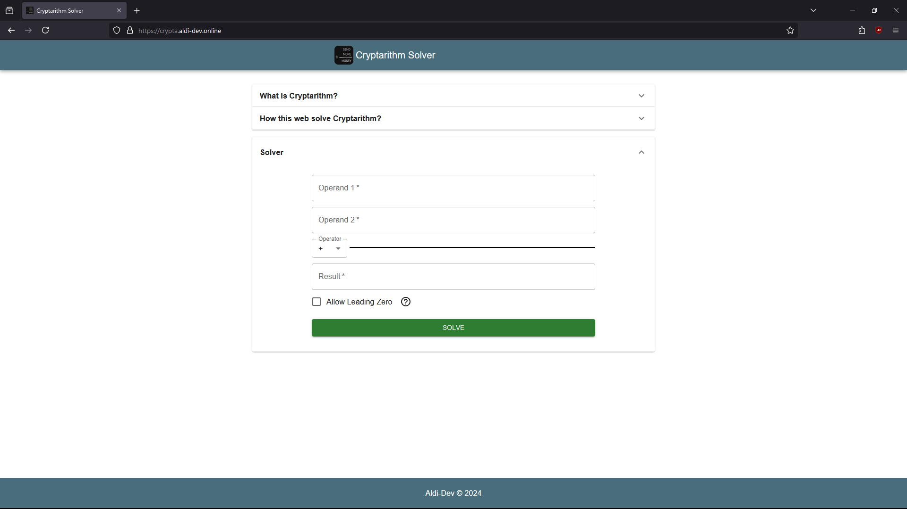
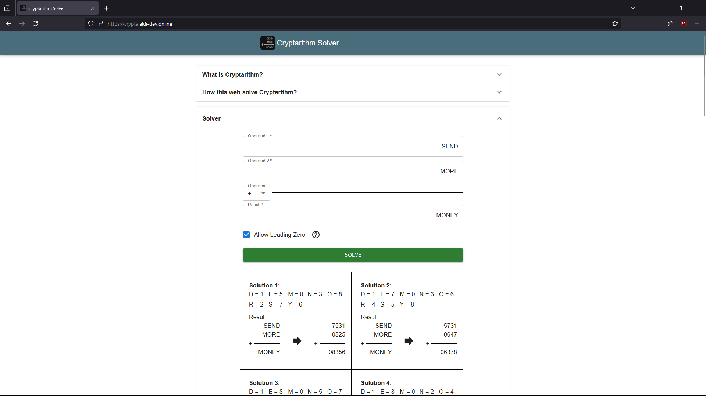

# Cryptarithm Solver

Live: <https:crypta.aldi-dev.online>

Preview:





## What is Cryptarithm

Verbal arithmetic, also known as alphametics, cryptarithmetic, cryptarithm or word addition, is a type of mathematical game consisting of a mathematical equation among unknown numbers, whose digits are represented by letters of the alphabet. The goal is to identify the value of each letter. The name can be extended to puzzles that use non-alphabetic symbols instead of letters.

The equation is typically a basic operation of arithmetic, such as addition, multiplication, or division. The classic example, published in the July 1924 issue of Strand Magazine by Henry Dudeney, is:


The solution to this puzzle is O = 0, M = 1, Y = 2, E = 5, N = 6, D = 7, R = 8, and S = 9.

Traditionally, each letter should represent a different digit, and (as an ordinary arithmetic notation) the leading digit of a multi-digit number must not be zero. A good puzzle should have one unique solution, and the letters should make up a phrase (as in the example above). (source: [Wikipedia](https://en.wikipedia.org/wiki/Verbal_arithmetic))

## How this project solve Cryptarithm

In short, it use **Brute Force**.

It tries all possible permutations of the unique letters obtained
from the given equation.

Example:


Unique letters: "D", "E", "M", "N", "O", "R", "S", "Y". (sorted)

Possible solutions (Permutations):

- "D" = 0, "E" = 1, "M" = 2, "N" = 3, "O" = 4, "R" = 5, "S" = 6, "Y" = 7
- "D" = 0, "E" = 1, "M" = 2, "N" = 3, "O" = 4, "R" = 5, "S" = 6, "Y" = 8
- "D" = 0, "E" = 1, "M" = 2, "N" = 3, "O" = 4, "R" = 5, "S" = 6, "Y" = 9
- ....

After trying all possible solutions, it will return the valid
solutions that satisfy the given equation.

For above example: "D"= 7, "E"= 5, "M"= 1, "N"= 6, "O"= 0, "R"= 8, "S"= 9, "Y"= 2

## How to run

- Install **Docker** (Docker desktop or Docker Engine + Docker Compose).
- Clone this repo.
- Create an **.env** file in the root directory of folder client and server and fill it with variables based on the examples in the **.env.example** file.
- Open terminal then change directory to the project and run docker compose command.

  ```bash
  docker compose up
  ```

  \*_It will take a couple of minutes depending on your hardwares and internet speed._

- Open your browser and go to <http://localhost:8080>

## How to continue develop this using **DevContainer**

- Make sure you have the following installed:

  - **Docker** (Docker Engine + Docker Compose or [Docker Desktop](https://www.docker.com/products/docker-desktop/))
  - **Visual Studio Code** ([VS Code](https://code.visualstudio.com/download))
  - **Remote Development** extension pack for VS Code (Install from the VS Code Extensions marketplace)

- Clone the repository:

  ```bash
  git clone <repository-url>
  cd <project-directory>
  ```

- Open the project in VS Code. _Make sure docker is running_.
- Reopen in Container.

  Once you have the Remote Development extension installed, you'll see a green Remote indicator in the bottom-left corner of the VS Code window. Click on the green indicator, or use Ctrl/Cmd + Shift + P to open the Command Palette and search for **Dev Containers: Reopen in Container**. VS Code will reopen the project inside the container.

- Dont forget to install dependencies in each folders (client and server)

  ```bash
  npm install
  ```

## Known issue

- env variables in client folder sometimes not properly included when building app.

  Temporary fix: Inject variables directly into the code (hardcoded).
